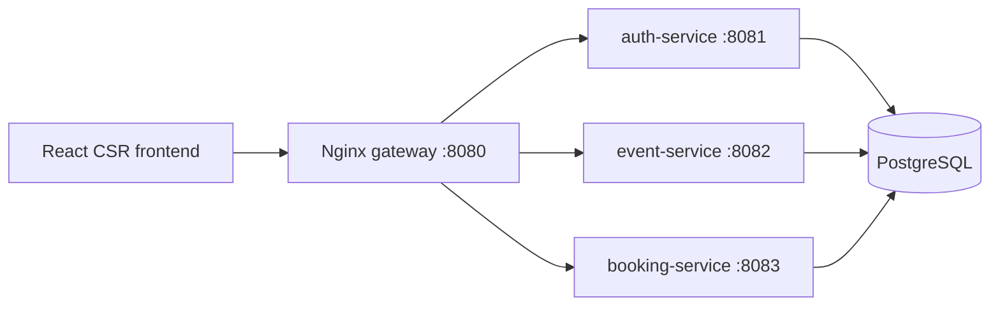
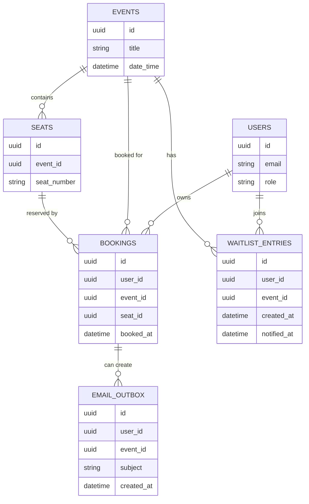
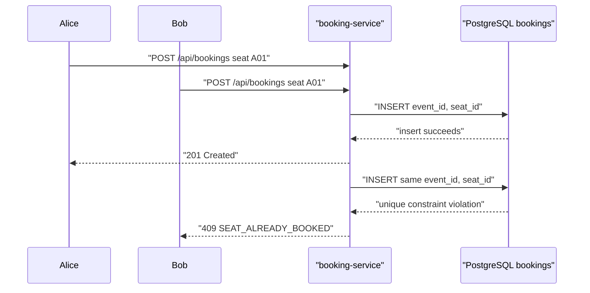

# Architecture

## Architectural Summary

The system is implemented as a distributed client/server application with three backend services and one browser-based frontend:

- `auth-service` handles identity, registration, login, JWT cookie issuance, and current-user lookup
- `event-service` handles event catalogue reads, admin event lifecycle management, seat generation/resizing, and seat availability reads
- `booking-service` handles single-seat and multi-seat booking writes, owned cancellation, waitlist entries, mock email outbox rows, and the double-booking guard
- `frontend` is a React CSR client that consumes REST APIs
- `nginx` acts as the single entry point for static frontend delivery and reverse proxying

This matches the course focus on client/server systems, SOA or microservice decomposition, REST communication, modularity, and deployability.

## Course Design Choices

- Lektion 05 JSON: server/client and service communication uses JSON because the payloads are structured API data rather than complex documents.
- Lektion 06 REST/Richardson: APIs target Richardson level 2 with resource URIs, HTTP verbs, status codes, and documented error bodies.
- Lektion 07 GraphQL: GraphQL was considered but intentionally not implemented because this booking workflow benefits from simple resource operations and explicit HTTP conflict responses.
- Lektion 08 CSR/SSR: CSR is used because the app is authenticated, interaction-heavy, and low-SEO; public SSR pages can be revisited later if needed.

## System Diagram

## Service Boundaries

### Auth Service

Responsibilities:

- register user accounts
- validate credentials
- issue JWT cookies
- return the authenticated user profile

Logical data ownership:

- `users`

### Event Service

Responsibilities:

- list events
- create, edit, publish, unpublish, cancel, and safely delete events for admins
- generate and resize numbered seats from seat capacity
- block capacity reductions that would remove booked seats
- return event detail
- expose seat availability by joining seats with bookings read-only

Logical data ownership:

- `events`
- `seats`

### Booking Service

Responsibilities:

- own booking write boundary
- create single-seat and all-or-nothing multi-seat bookings for authenticated users
- return the authenticated user’s active bookings
- return event booking lists for admins
- cancel owned future bookings
- manage waitlist entries and mock email outbox rows
- enforce the shared-database seat uniqueness constraint through schema ownership

Logical data ownership:

- `bookings`
- `waitlist_entries`
- `email_outbox`

## Data Ownership Diagram

## Shared Database Strategy

The current implementation uses one PostgreSQL database because it is the safest course-project setup while still supporting service decomposition.

Important implementation note:

- The database schema is migrated centrally during auth-service startup.
- Table ownership is still logically documented per service even though the schema bootstrap is centralized.
- This decision keeps the empty repo bootstrap simple while preserving the intended service boundaries for later iterations.

## Concurrency Strategy

The system prevents double booking at the database level using:

- `UNIQUE (event_id, seat_id)` on the `bookings` table
- transactional booking insert logic in `booking-service`
- event-service read models that derive availability from bookings instead of mutable seat state

## API Style

The APIs use:

- JSON request and response bodies
- resource-based URIs
- standard HTTP verbs
- standard HTTP status codes
- OpenAPI documentation

This targets Richardson maturity model level 2:

- resources
- correct HTTP verbs
- HTTP status codes and headers

HATEOAS is deferred.

## Frontend Rendering Choice

The frontend deliberately uses CSR with React and Vite:

- the core flow is authenticated and interaction-heavy
- SEO is not a primary requirement for the booking dashboard
- CSR gives faster delivery of a usable first vertical slice

SSR remains a possible later enhancement if public marketing pages become a requirement.

## Runtime Topology

### Local Development

- frontend dev server on `5173`
- auth-service on `8081`
- event-service on `8082`
- booking-service on `8083`

### Docker Deployment

- nginx gateway on `8080`
- auth-service behind nginx
- event-service behind nginx
- booking-service behind nginx
- postgres behind internal network
